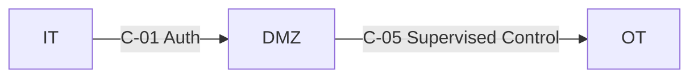

# IEC62443 Compliance as Code
Infrastructure-as-Code and Policy-as-Code patterns for implementing and evidencing IEC 62443 security requirements in industrial and OT environments.

## Purpose

This repository provides a structured, automatable approach to aligning systems and architectures with the IEC 62443 series by:
- Defining zones and conduits as code
- Mapping technical controls to IEC 62443 requirements
- Generating machine-verifiable evidence
- Supporting continuous compliance validation
- Enabling secure SDLC and infrastructure deployment pipelines

The goal is to treat compliance as a repeatable engineering outcome, not a manual audit exercise.

## Scope

This repository supports:
- Zone & conduit modeling
- Control intent documentation
- Security requirement traceability
- Evidence tracking via IDs
- CI/CD validation workflows
- Infrastructure compliance automation

It is intentionally generic and sanitized for use in public repositories.

Sensitive diagrams, configurations, and audit artefacts should be stored privately and referenced via Evidence IDs only.

## Standards Alignment

This project aligns with the IEC 62443 series, including:
- IEC 62443-2-x – Security program requirements
- IEC 62443-3-2 – Risk assessment & system requirements
- IEC 62443-3-3 – System security requirements and security levels
- IEC 62443-4-x – Component and development requirements

The repository structure is designed to support traceability between:

## Design Principles
- Zero Trust between zones
- Explicitly defined conduits
- Least privilege enforcement
- Strong authentication & authorization
- Segmentation & protocol allowlisting
- Auditability by design
- Immutable infrastructure patterns
- Continuous verification

## Zones & Conduits Model

Security architecture is defined using a zone-and-conduit model:
- Zones represent trust boundaries
- Conduits define controlled communication paths
- Each conduit includes:
- Purpose
- Allowed services
- Security controls
- Evidence references

Example (Mermaid):

## Automation Approach

Compliance validation can be integrated into CI/CD pipelines:
- Infrastructure scanning
- Policy linting
- Configuration validation
- Drift detection
- Evidence artifact generation

Example workflow:

Code Commit  

   ↓  
   
Pipeline Validation  

   ↓  
   
Control Mapping Check  

   ↓  
   
Evidence Artifact Generated  

   ↓  
   
Compliance Status Report

## Evidence Handling

This is a public repository.
- Do NOT store:
- Live network diagrams
- IP addresses
- Hostnames
- Credentials
- Audit artefacts
- Store sensitive artefacts in private storage
- Reference them using Evidence IDs only

## Contribution Guidelines
- Keep all examples generic and sanitized
- Avoid vendor-specific confidential details
- Use evidence references instead of sensitive data
- Maintain traceability to IEC 62443 requirements

!! Disclaimer !!

This repository provides engineering patterns to support IEC 62443 alignment.
It does not replace formal certification, risk assessment, or third-party audit processes.
