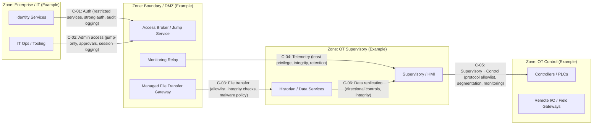

# Zones & Conduits (Template)

## Purpose
Document your zones, conduits, trust boundaries, and the controls applied to each conduit.

## Diagram (Mermaid)

## Conduit Register (template)

| Conduit ID | From Zone   | To Zone  | Purpose           | Allowed Services | Control Intent                     | Evidence IDs |
| ---------- | ----------- | -------- | ----------------- | ---------------- | ---------------------------------- | ------------ |
| C-01       | IT          | Boundary | Auth              | e.g., 443/LDAPS  | strong auth, least privilege, logs | EVID-###     |
| C-05       | Supervisory | Control  | Control protocols | allowlist only   | segmentation, monitoring           | EVID-###     |

## Note this is a public repo therefore:

*   Keep diagrams generic and sanitized.
*   Store sensitive diagrams/evidence in private storage and reference them via Evidence IDs only.
